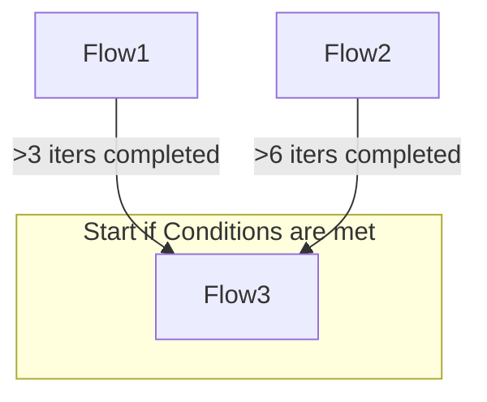
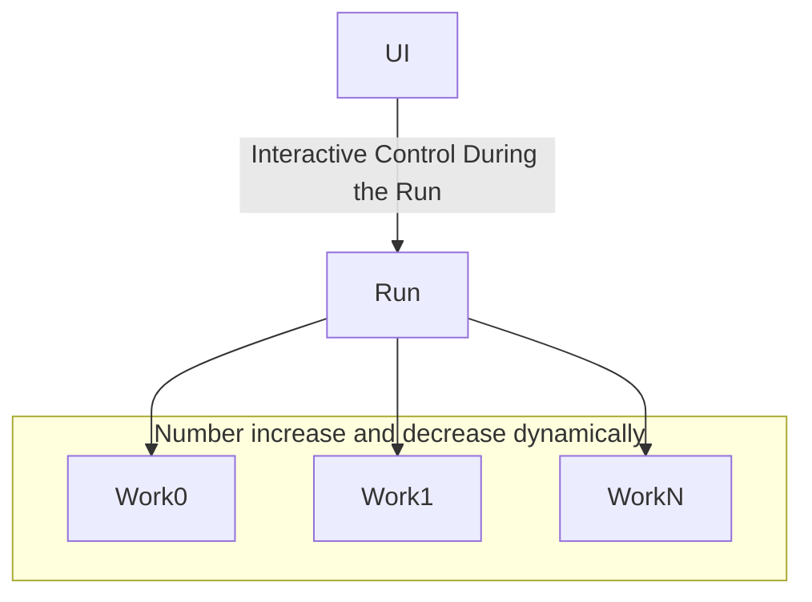
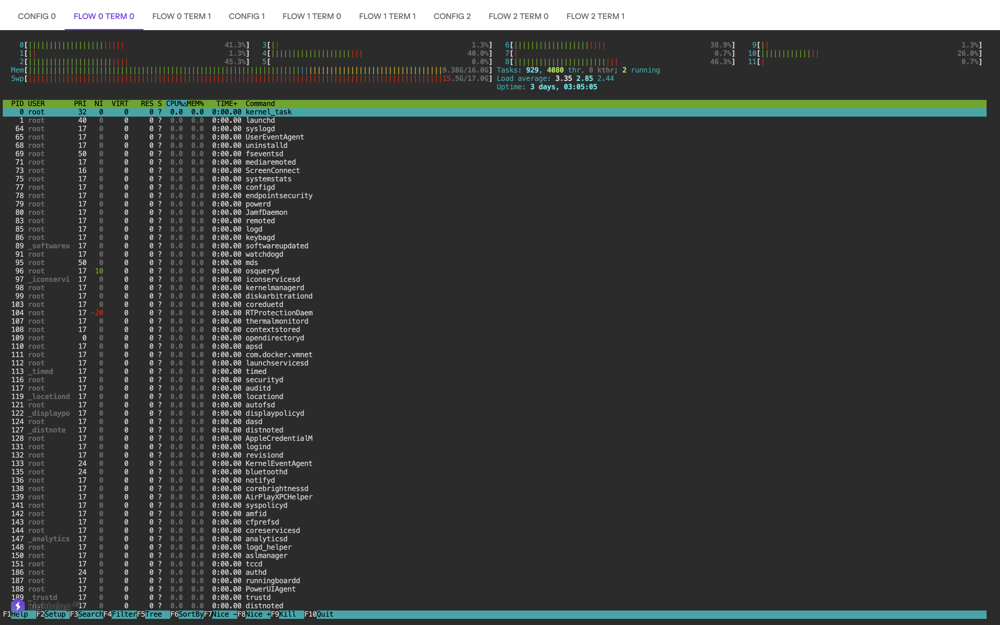
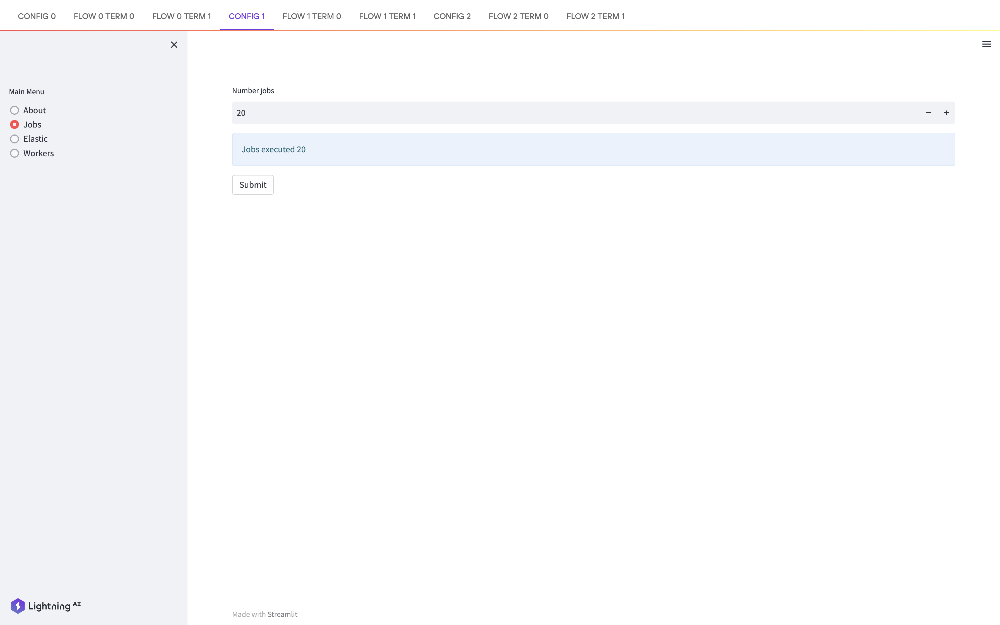
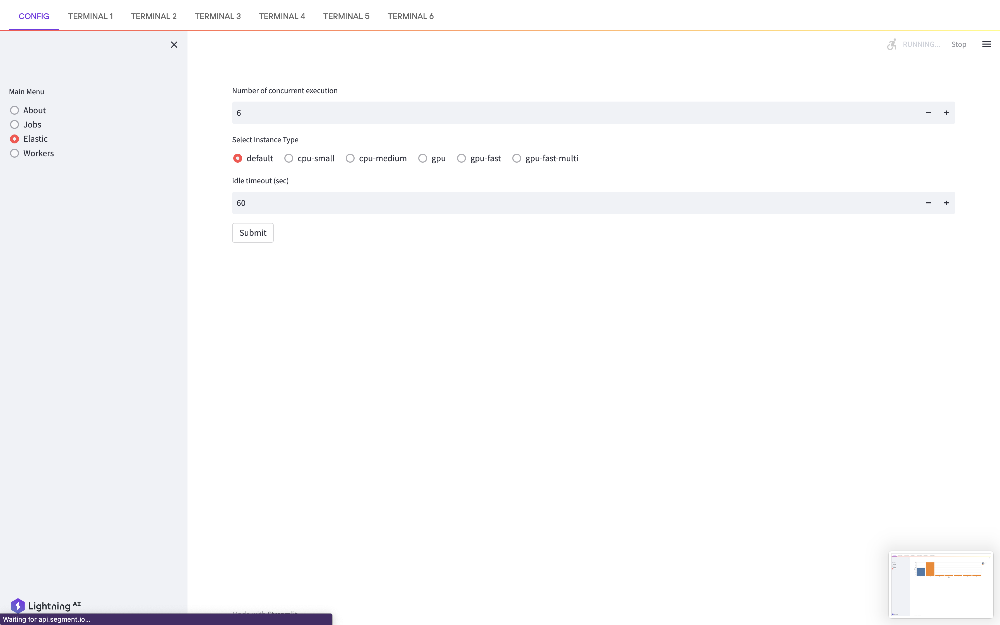
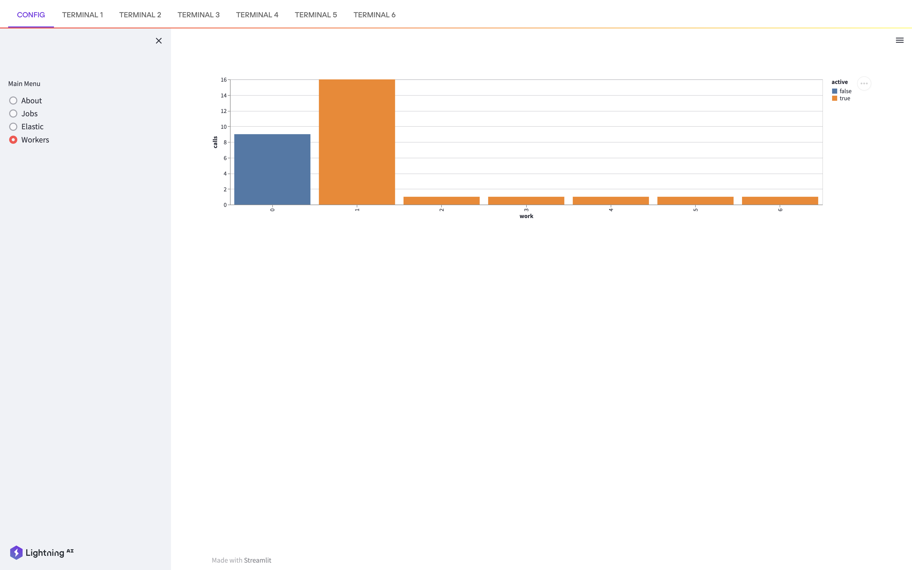

A Lightning App demo of hierarchical jobs with interactive control on parallelism.  Dunamic research flow and ealstic production pipeliens are possible with Lighting App. 

Techniques demonstrated:
- Flows within Flow..
- Flow with dynamic number of Works within.
- Works starting and shutting dynamically.
- A work starts when there is something to run.
- Work terminates after specified number of idle time to save cost.
- Work has active terminal while running for debugging.
- UI is dynamically generated.

# The Demo Arch

A Flow has two two Flows within it.

Each Flow has elastic (scale out and scale in) number of Works.

# Screen shots

Work has active terminal while running for debugging.

A work starts when there is something to run.

It terminates after specified number of idle time to save cost.

UI is dynamically generated.

